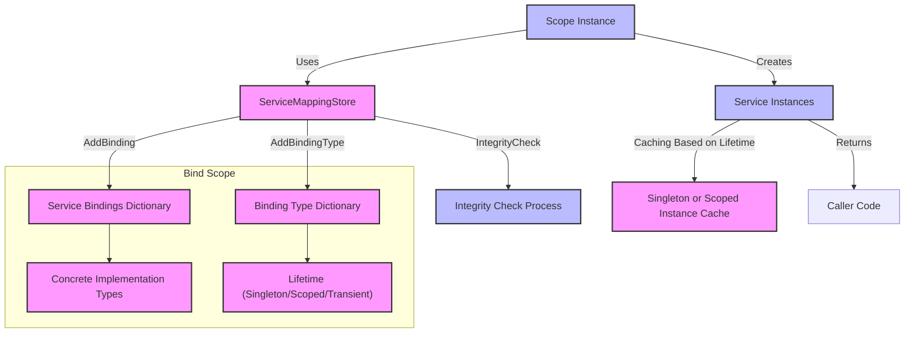

# Registering and Managing Services

This guide empowers you to confidently register your application services, manage their lifetimes, and configure the service mapping store within the BSP Dependency Injection Framework. By following practical steps, you will organize dependencies effectively, ensuring smooth instance resolution and lifecycle management tailored to typical .NET application scenarios.

---

## 1. Understanding the Service Registration Workflow

### Task Description
This guide walks you through:
- Registering services using appropriate lifetimes (Singleton, Scoped, Transient)
- Using the ServiceMappingStore to maintain service mappings
- Performing integrity checks to detect configuration errors
- Managing dependencies in complex scenarios

### Prerequisites
- Familiarity with basic .NET development
- BSP.Dependency.Injection framework added to your project
- Understanding of the Dependency Injection concept—refer to the [Core Concepts & Terminology](../../overview/introduction-core-concepts/core-terminology-concepts) page for a primer

### Expected Outcome
By the end of this guide, you'll:
- Have a configured ServiceMappingStore registering multiple services
- Understand how to specify and manage service lifetimes
- Be able to verify your service graph integrity
- Set up scopes for correct service resolution

### Time Estimate
15-30 minutes, depending on familiarity

### Difficulty Level
Beginner to Intermediate

---

## 2. Step-by-Step Instructions

<Steps>
<Step title="Create and Initialize ServiceMappingStore">
Start by creating an instance of the `ServiceMappingStore`. This acts as the central registry where all your service-to-implementation bindings are held.

```csharp
var serviceMappingStore = new ServiceMappingStore();
```

**Expected Result:**
- An empty store ready to accept registrations.
</Step>

<Step title="Register Services with Lifetimes">
Register your services by pairing interface types with their concrete implementations and assigning lifetimes corresponding to application needs:

- **Singleton:** One shared instance throughout the application's life
- **Scoped:** One instance per resolution scope
- **Transient:** New instance every time requested

Use the relevant methods:

```csharp
serviceMappingStore.AddSingleton<IYourInterface, YourSingletonClass>();
serviceMappingStore.AddScoped<IYourInterface, YourScopedClass>();
serviceMappingStore.AddTransient<IYourInterface, YourTransientClass>();
```

**Example using BSP.Example classes:**

```csharp
serviceMappingStore.AddSingleton<IDepInterface1, DepClass1>();
serviceMappingStore.AddTransient<IDepInterface2, DepClass2>();
serviceMappingStore.AddScoped<IDepInterface3, DepClass3>();
```

**Expected Result:**
- Bindings added to the store with clear lifetime definitions.
</Step>

<Step title="Run Integrity Check">
Before proceeding, validate your service registrations to catch issues like missing service mappings or circular dependencies early.

Invoke:

```csharp
serviceMappingStore.IntegrityCheck();
```

- The integrity check recursively inspects constructor dependencies.
- It throws exceptions if:
  - A dependency mapping is missing
  - Circular references are detected

**Expected Result:**
- No exceptions mean registrations are sound.
- Exception messages clearly identify problems for quick resolution.

**Decision Point:**
- If an error occurs, review your registrations for missing services or circular dependencies.
</Step>

<Step title="Create Scope for Resolution">
Create a `Scope` instance using the configured `ServiceMappingStore`. The scope manages the lifetime boundaries and instance caches.

```csharp
var scope = new Scope(serviceMappingStore);
```

**Expected Result:**
- A new scope is initialized, ready to resolve instances respecting lifetimes.
</Step>

<Step title="Resolve Service Instances">
Use the scope to request instances of registered services. Dependencies will be automatically constructed following their lifetimes:

```csharp
var instance = scope.GetInstance<IDepInterface5>();
instance.DoThing();
```

**Expected Result:**
- The object graph is built and injected appropriately.
- Output behavior confirms correct wiring of dependencies.

**Tip:**
- Repeated instance requests respect the lifetime rules:
  - Singleton instances are reused
  - Scoped instances are unique per scope
  - Transient instances are new each time
</Step>
</Steps>

---

## 3. Practical Example from BSP.Example

Consider this snippet from the `CaseRunner` class demonstrating service registration and scope-based resolution:

```csharp
var serviceMappingStore = new ServiceMappingStore();
serviceMappingStore.AddSingleton<IDepInterface1, DepClass1>();
serviceMappingStore.AddTransient<IDepInterface2, DepClass2>();
serviceMappingStore.AddScoped<IDepInterface3, DepClass3>();
serviceMappingStore.AddScoped<IDepInterface4, DepClass4>();
serviceMappingStore.AddTransient<IDepInterface5, DepClass5>();

serviceMappingStore.IntegrityCheck();

var scope = new Scope(serviceMappingStore);

var instance1 = scope.GetInstance<IDepInterface5>();
instance1.DoThing();

Console.WriteLine("new scope");

var instance2 = scope.GetInstance<IDepInterface2>();
instance2.DoThing();
```

This setup demonstrates:
- Multiple service registrations with diverse lifetimes
- Integrity validation before instance resolution
- Usage of the same scope to retrieve various service instances

Output logs confirm lifecycle management and dependency injection in action.

---

## 4. Practical Tips & Best Practices

- **Consistently Run Integrity Checks:** Always run `IntegrityCheck()` after registrations to catch issues early.

- **Be Mindful of Circular Dependencies:** They cause runtime exceptions and often indicate design problems.

- **Choose Lifetimes Thoughtfully:** Use singleton when state sharing is needed, scoped for temporary shared state per workflow, transient for stateless, short-lived objects.

- **Avoid Registering Too Many Transients:** Excessive transient objects can impact performance due to frequent instantiations.

- **Group Registrations Logically:** For larger apps, modularize registrations to keep the store organized.

- **Leverage Constructor Injection:** Ensure all dependencies are declared in constructors to leverage automatic resolution.

---

## 5. Common Issues & Troubleshooting

<AccordionGroup title="Troubleshooting Service Registration Issues">
<Accordion title="Circular Dependency Error">
**Symptom:** Exception notes circular reference between types.

**Cause:** Two or more services depend on each other forming a cycle.

**Solution:** Refactor dependencies to break the cycle, often by introducing interfaces or using lazy loading.
</Accordion>

<Accordion title="Missing Mapping Exception">
**Symptom:** Exception thrown stating a mapping for a dependency type is not found.

**Cause:** A required service was not registered.

**Solution:** Add explicit registrations for all interfaces your implementations depend on.
</Accordion>

<Accordion title="Incorrect Lifetime Usage">
**Symptom:** Unexpected behavior relating to instance reuse (too many or too few).

**Cause:** Lifetime misconfiguration, for example registering a service as transient when singleton is needed.

**Solution:** Review lifetime choices; match lifetime to the service’s responsibility and usage pattern.
</Accordion>
</AccordionGroup>

---

## 6. Next Steps & Related Content

- Explore the [Quick Start: From Registration to Resolution](../../overview/architecture-features-getting-started/quick-start-example) guide for a hands-on example walkthrough.
- Dive into [Resolving Instances from the DI Scope](./resolving-instances) to master instance retrieval.
- Review [Dependency Injection Best Practices & Patterns](../../guides/real-world-usage/di-patterns) for advanced design strategies.
- Reference [System Architecture & Data Flow](../../overview/architecture-features-getting-started/architecture-visual) for a visual understanding of component interactions.

---

## Appendix: BSP.Dependency.Injection Core Registration API

```csharp
// Registers a service with singleton lifetime.
void AddSingleton<TInterface, TImplementation>() where TImplementation : TInterface;

// Registers a service with transient lifetime.
void AddTransient<TInterface, TImplementation>() where TImplementation : TInterface;

// Registers a service with scoped lifetime.
void AddScoped<TInterface, TImplementation>() where TImplementation : TInterface;

// Validates all registrations for circular and missing dependencies.
void IntegrityCheck();
```

Use these methods exclusively on `ServiceMappingStore`.

---

## Visualizing the Registration and Resolution Flow




---