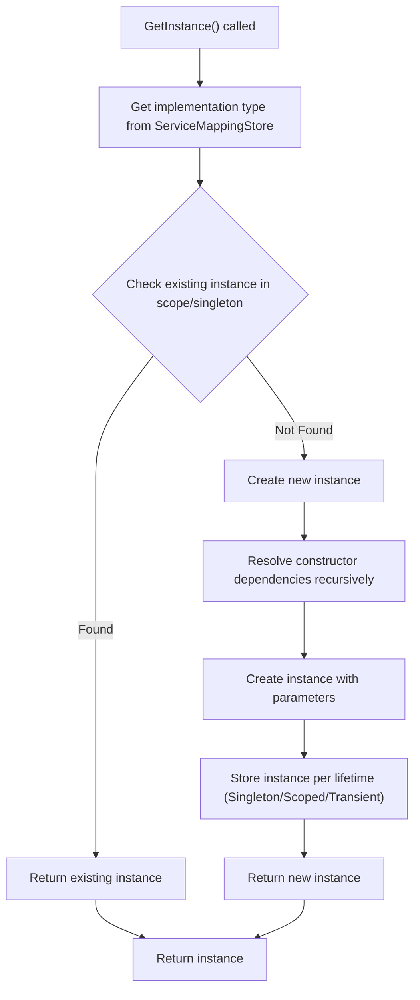

# Resolving Instances from the DI Scope

## Workflow Overview

**Task Description:**
This guide helps you resolve service instances at runtime using the BSP Dependency Injection framework's `Scope` class. You will learn how to request instances of registered services, manage their lifetimes, and invoke their methods to effectively work with your dependency tree.

**Prerequisites:**
- Have a configured `ServiceMappingStore` with your service interfaces and implementations registered.
- Ensure service mappings have passed the integrity checks to avoid circular dependencies or missing bindings.
- Basic understanding of dependency injection concepts such as singleton, scoped, and transient lifetimes.

**Expected Outcome:**
By the end of this guide, you will be able to:
- Create a `Scope` instance for dependency resolution.
- Retrieve concrete service instances from the scope via `GetInstance<T>()`.
- Understand how service lifetimes affect instance creation and reuse within the scope.
- Use resolved instances to invoke their functionality, confirming proper dependency injection.

**Time Estimate:** 10–15 minutes

**Difficulty Level:** Intermediate

---

## Step-by-Step Instructions

<Steps>
<Step title="Prepare Your Service Mappings">
Start by registering your services in a configured `ServiceMappingStore`. Each service interface must be mapped to a concrete implementation with a specific lifetime: singleton, scoped, or transient.

Example:
```csharp
var serviceMappingStore = new ServiceMappingStore();
serviceMappingStore.AddSingleton<IDepInterface1, DepClass1>();
serviceMappingStore.AddTransient<IDepInterface2, DepClass2>();
serviceMappingStore.AddScoped<IDepInterface3, DepClass3>();
// Add additional mappings as needed

// Perform integrity check to ensure no circular dependencies
serviceMappingStore.IntegrityCheck();
```

**Expected Result:** Your service mappings are registered and validated.
</Step>

<Step title="Create a Resolution Scope">
Instantiate a new `Scope` by passing your `ServiceMappingStore` instance. This scope will manage the lifecycle of scoped and singleton instances during resolution.

Example:
```csharp
var scope = new Scope(serviceMappingStore);
```

**Expected Result:** A fresh scope is ready for resolving instances.
</Step>

<Step title="Resolve Service Instances Using `GetInstance<T>()`">
Use the generic `GetInstance<T>()` method on the scope to request an instance of your registered service interface. The method will recursively resolve all dependencies, honoring service lifetimes:

- **Singleton:** One shared instance per application lifetime.
- **Scoped:** One instance per `Scope` lifetime.
- **Transient:** A new instance every time requested.

Example:
```csharp
var instance = scope.GetInstance<IDepInterface5>();
```

**Expected Result:** You receive a fully constructed instance, including all nested dependencies.
</Step>

<Step title="Invoke Methods on Resolved Instances">
Once you have a resolved instance, call its methods to verify correct behavior and confirm dependencies are wired properly.

Example:
```csharp
instance.DoThing();
```

This method invokes actions of the resolved instance and its dependencies recursively.

**Expected Result:** Console output demonstrates method invocation from the entire dependency chain.
</Step>

<Step title="Manage Multiple Resolution Requests">
You can perform multiple calls to `GetInstance<T>()` on the same scope or different scopes to observe lifetime behavior.

Example:
```csharp
var instance1 = scope.GetInstance<IDepInterface5>();
instance1.DoThing();

Console.WriteLine("new scope");

var instance2 = scope.GetInstance<IDepInterface2>();
instance2.DoThing();
```

**Decision Point:** Choose the service to resolve based on your needs; understand that singletons maintain shared instances, scoped services are unique per scope, and transient services are always new.

**Expected Result:** Output distinguishes instances by unique IDs indicating lifetime handling.
</Step>

<Step title="Verify Proper Instance Creation and Lifetimes">
The `Scope` internally manages instance creation and caching based on service lifetime. Singleton instances are stored and reused; scoped instances exist only within the current scope resolution; transient generates fresh objects every call.

If lifetimes are respected, repeated resolutions should reuse or recreate instances correctly.

**Verification:**
- Singleton instances retain the same identity across calls.
- Scoped instances are the same within a scope but differ across scopes.
- Transient instances differ every time.
</Step>
</Steps>

---

## Real-World Example

Here is a simplified demonstration extracted from `CaseRunner.cs`:

```csharp
var serviceMappingStore = new ServiceMappingStore();
serviceMappingStore.AddSingleton<IDepInterface1, DepClass1>();
serviceMappingStore.AddTransient<IDepInterface2, DepClass2>();
serviceMappingStore.AddScoped<IDepInterface3, DepClass3>();
serviceMappingStore.AddScoped<IDepInterface4, DepClass4>();
serviceMappingStore.AddTransient<IDepInterface5, DepClass5>();

serviceMappingStore.IntegrityCheck();

var scope = new Scope(serviceMappingStore);

var instance1 = scope.GetInstance<IDepInterface5>();
instance1.DoThing();

Console.WriteLine("new scope");

var instance2 = scope.GetInstance<IDepInterface2>();
instance2.DoThing();
```

**Expected Console Output:** The unique IDs printed by `DoThing()` reflect the correct creation and reuse of instances.

---

## Troubleshooting & Tips

<AccordionGroup title="Troubleshooting Common Issues">
<Accordion title="Service Not Registered Exception">
If you attempt to resolve a service that is not registered, an exception is thrown indicating a missing mapping.

**Solution:** Ensure all dependencies are registered and mappings exist in the `ServiceMappingStore`.
</Accordion>
<Accordion title="Circular Dependency Detected">
An integrity check failure will alert you to circular dependencies that cannot be resolved.

**Solution:** Refactor services to remove circular references, or comment out problematic mappings until your design is clean.
</Accordion>
<Accordion title="Unexpected Instance Lifetime Behavior">
Instances unexpectedly behave like singletons or transient across scopes.

**Solution:** Double-check how services are registered (Singleton, Scoped, Transient) and how the `Scope` is reused or recreated.
</Accordion>
</AccordionGroup>

<Tip>
Creating a new `Scope` each logical unit or request ensures scoped dependencies behave as intended without leaking instances across lifetimes.
</Tip>

<Tip>
Use console logs (already provided in `Scope.cs`) to trace instance creation and verify injection order during development.
</Tip>

---

## Architecture & Internals (Overview)

The `Scope` class uses the registered service mappings to resolve instances recursively:
- It retrieves the concrete implementation type for the requested interface.
- It checks if an instance already exists within the singleton or scoped cache.
- If not, it creates a new instance, passing recursively resolved constructor arguments.
- Based on lifetime, instances are cached accordingly.

This process ensures that complex dependency trees are constructed correctly and efficiently.



---

## Next Steps & Related Content

- **Registering and Managing Services:** Learn how to define your service registrations and lifetimes properly.
- **Basic Setup & Configuration:** Understand initial setup required before resolution.
- **Practical Use Cases and Example Workflows:** Explore more complex scenarios with practical applications.
- **Dependency Injection Best Practices & Patterns:** Improve your designs by following best practices.

For more details on lifecycle management or troubleshooting, see the [Getting Started Guides](https://yourdocsite/guides/getting-started).


---

## References
- [ServiceMappingStore.cs](https://github.com/bspjojo/DependencyInjection/blob/main/BSP.Dependency.Injection/DependencyInjection/ServiceMappingStore.cs)
- [Scope.cs](https://github.com/bspjojo/DependencyInjection/blob/main/BSP.Dependency.Injection/DependencyInjection/Scope.cs)
- [CaseRunner.cs example](https://github.com/bspjojo/DependencyInjection/blob/main/BSP.Example/Cases/CaseRunner.cs)


---

> This guide empowers you to confidently create dependency injection scopes and resolve services, turning your dependency graphs into running, testable instances effortlessly.