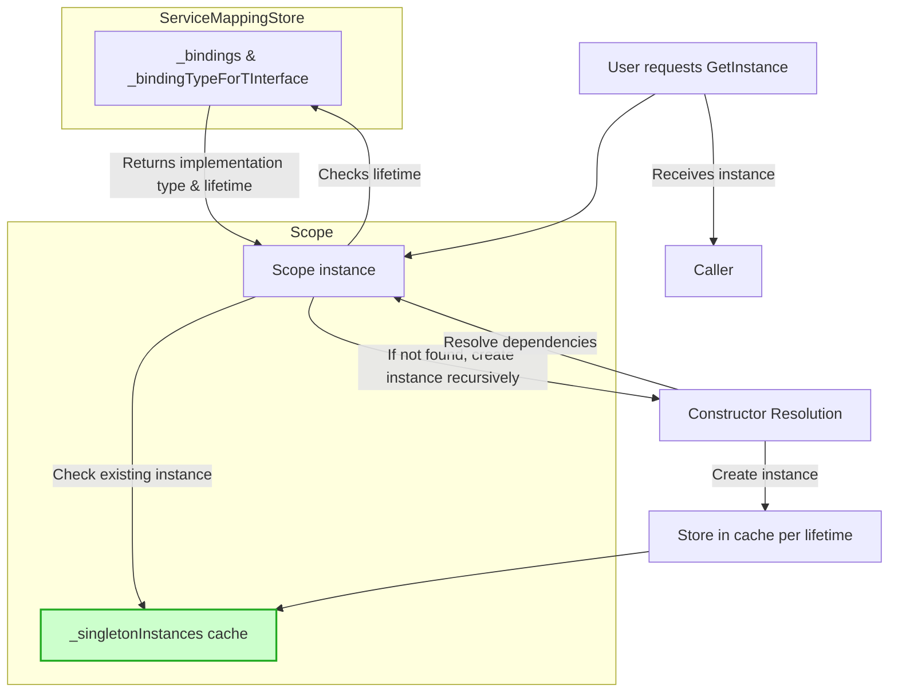

# Dependency Injection Best Practices & Patterns

Discover proven patterns and strategies to leverage the BSP Dependency Injection Framework for maximum maintainability, flexibility, and robustness. This guide walks you through essential concepts such as service lifetime management, modular architecture, and how to avoid common anti-patterns like circular dependencies.

---

## 1. Understanding Service Lifetimes

The BSP Dependency Injection Framework supports three principal lifetimes when registering services:

- **Singleton:** One shared instance for the entire application lifetime.
- **Scoped:** One instance per scope (e.g., per resolution scope).
- **Transient:** A new instance every time the service is requested.

Choosing the correct lifetime is crucial for resource management and application behavior.

### Best Practices

- Use **Singletons** for stateless or thread-safe services that can be shared globally (e.g., configuration providers).
- Use **Scoped** lifetimes for services that need to maintain state or dependencies during a logical operation or transaction.
- Use **Transient** for lightweight, stateless services where isolated instances are required.

<Tip>
Choosing the wrong lifetime can lead to unexpected side effects, such as stale data or memory leaks. Always align the lifetime with the service's responsibility.
</Tip>

---

## 2. Service Registration & Modularization

To maintain a clean and scalable codebase, structure your service registrations logically by feature or module.

### How to Modularize

1. Create separate registration methods or classes per module.
2. Encapsulate service mappings related to each functional area.
3. Register these modules centrally during application startup.

This approach promotes separation of concerns and makes future maintenance easier.

### Example

```csharp
var serviceMappingStore = new ServiceMappingStore();

// Module A
serviceMappingStore.AddSingleton<IServiceA, ServiceA>();
serviceMappingStore.AddScoped<IServiceB, ServiceB>();

// Module B
serviceMappingStore.AddTransient<IServiceC, ServiceC>();

serviceMappingStore.IntegrityCheck();

var scope = new Scope(serviceMappingStore);
var instance = scope.GetInstance<IServiceB>();
instance.DoWork();
```

---

## 3. Avoiding Common Anti-Patterns

### Circular Dependencies

Circular dependencies cause runtime exceptions and break the integrity of your service graph.

#### How BSP Dependency Injection Detects Circularity

`ServiceMappingStore.IntegrityCheck()` performs a deep recursive analysis of constructor dependencies, throwing exceptions when cycles are detected.

#### Avoidance Tips

- Prefer constructor injection only for dependencies that do not cause loops.
- Split services or refactor dependencies to break cycles.
- Use interfaces to abstract away tightly coupled implementations.

### Example of a Circular Dependency (Do NOT register as is)

```csharp
// These registrations throw on IntegrityCheck
// serviceMappingStore.AddSingleton<ICircSelf, CircSelf>();
// serviceMappingStore.AddTransient<ICircOther1, CircOther1>();
// serviceMappingStore.AddScoped<ICircOther2, CircOther2>();
```

<Tip>
Always run `IntegrityCheck()` after registration to catch configuration errors early.
</Tip>

---

## 4. Dependency Resolution Flow

When resolving a service through a `Scope`, the framework:

1. Determines the implementation type and lifetime.
2. Checks if an instance already exists in the relevant lifetime cache.
3. If no existing instance, constructs the object recursively resolving dependencies in constructor parameters.
4. Stores or discards the instance based on lifetime:
   - Singleton instances persist for all scopes.
   - Scoped instances live within the current scope.
   - Transient instances are created anew each request.

This automatic recursive resolution facilitates clean and maintainable code.

---

## 5. Practical Example: Running a Complex Case

Below is a walkthrough of a real example from the BSP.Example project, showing registration with diverse lifetimes and usage.

```csharp
var serviceMappingStore = new ServiceMappingStore();

// Register services with varied lifetimes
serviceMappingStore.AddSingleton<IDepInterface1, DepClass1>();
serviceMappingStore.AddTransient<IDepInterface2, DepClass2>();
serviceMappingStore.AddScoped<IDepInterface3, DepClass3>();
serviceMappingStore.AddScoped<IDepInterface4, DepClass4>();
serviceMappingStore.AddTransient<IDepInterface5, DepClass5>();

// Validate configuration to avoid circular deps or missing mappings
serviceMappingStore.IntegrityCheck();

var scope = new Scope(serviceMappingStore);

// Resolve and use a transient service
var instance1 = scope.GetInstance<IDepInterface5>();
instance1.DoThing();

Console.WriteLine("new scope");

// Resolve another transient service
var instance2 = scope.GetInstance<IDepInterface2>();
instance2.DoThing();
```

### Expected Output

The output will display unique IDs and invocation cascades corresponding to the lifetime and dependency tree.

---

## 6. Tips for Maintainability and Flexibility

- **Leverage interfaces consistently** to decouple implementations and facilitate testing.
- **Favor composition over inheritance** to reduce complexity.
- **Keep constructor dependencies minimal** to avoid bloated signatures and ease readability.
- **Group related services** to logically segment your application.
- **Use the integrity check regularly**, ideally during build or startup.

<Tip>
Write unit tests for your DI registrations by verifying resolution with mocked or real services within scopes.
</Tip>

---

## 7. Troubleshooting Common Issues

### Missing Mappings

If `IntegrityCheck()` fails due to missing service registrations, ensure every constructor parameter's interface is registered.

### Circular Reference Exception

See the exception message and stack to identify the cycle. Refactor the service design to break the loop.

### Lifetime Misuse

Unexpected behavior often stems from mixing lifetimes improperly (e.g., a singleton depending on scoped services). Review dependencies critically.

<Warning>
Misconfigured lifetimes can cause subtle bugs. Always validate assumptions when mixing scoped and singleton dependencies.
</Warning>

---

## 8. Visualizing the Dependency Injection Flow



This flowchart summarizes how the framework manages registrations, checks scopes, and resolves dependencies with appropriate lifetime handling.

---

## 9. Next Steps

- Explore **Registering and Managing Services** guide for detailed syntax and configuration.
- Review **Resolving Instances from the DI Scope** for deeper understanding of service lifecycle interactions.
- Consult **Validation & Troubleshooting** for tips on diagnosing issues early.
- Try implementing your custom modules applying these design principles.

---

## Summary
This guide equips you with the foundational patterns to register services correctly, manage their lifetimes, modularize registrations, and avoid critical pitfalls like circular dependencies. By applying these principles, you will enable resilient and maintainable dependency injection for your .NET applications using the BSP Dependency Injection Framework.

---

For full source and examples, see the project repository.

---

## Useful Links
- [Service Registration Guide](https://docs.example.com/guides/getting-started/registering-services)
- [Resolving Instances Guide](https://docs.example.com/guides/getting-started/resolving-instances)
- [Integrity Check & Troubleshooting](https://docs.example.com/getting-started/quickstart-experience/validation-and-troubleshooting)
- [System Architecture & Data Flow](https://docs.example.com/overview/architecture-features-getting-started/architecture-visual)


