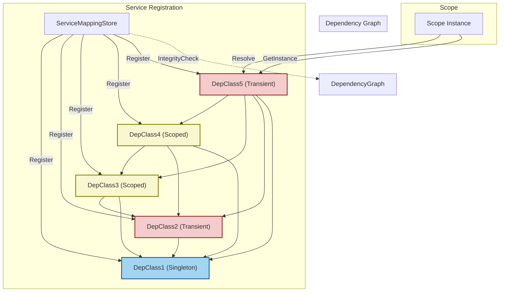

# Practical Use Cases and Example Workflows

Welcome to the practical guide for using the BSP Dependency Injection Framework through real-world scenarios. This page bridges theory and application, walking you through organizing, resolving, and managing dependencies across diverse application setups. You'll find runnable code samples annotated to illustrate key concepts clearly, ensuring you can translate learning directly into your own projects.

---

## 1. Understanding the Use Cases

**What is this guide for?**

This guide empowers you to effectively use the BSP Dependency Injection Framework by showcasing representative workflows that demonstrate how to:

- Register services with different lifetimes (Singleton, Scoped, Transient).
- Configure and validate service mappings.
- Manage dependency chains of varying complexity.
- Detect and handle circular dependencies.
- Resolve services within a scope to gain properly constructed instances.

**Prerequisites:**

- Familiarity with .NET Core 3.1 development.
- BSP.Dependency.Injection framework installed and added to your project.
- Basic understanding of dependency injection concepts.

**Expected Outcome:**

By following this guide, you will:

- Build confidence in registering and managing service dependencies.
- Understand configuration integrity checks.
- See how to resolve instances in controlled scopes.
- Gain troubleshooting know-how for common DI pitfalls.

**Estimated Time:** Approximately 15-25 minutes for full walkthrough.

**Difficulty:** Intermediate (some knowledge of DI patterns and C# recommended).

---

## 2. Step-by-Step Example Workflows

We will use the example project `BSP.Example` and its class hierarchy to illustrate the concepts.

### Workflow Overview

- Services are interfaces (`IDepInterfaceX`) implemented by concrete classes (`DepClassX`).
- Dependencies are injected via constructors.
- Service lifetimes include **Singleton**, **Scoped**, and **Transient**.
- The `ServiceMappingStore` manages mappings and lifetimes.
- The `Scope` class handles resolving instances.

### Step 1: Registering Your Services

Services must be registered in the `ServiceMappingStore` before resolution.

```csharp
var serviceMappingStore = new ServiceMappingStore();
serviceMappingStore.AddSingleton<IDepInterface1, DepClass1>();
serviceMappingStore.AddTransient<IDepInterface2, DepClass2>();
serviceMappingStore.AddScoped<IDepInterface3, DepClass3>();
serviceMappingStore.AddScoped<IDepInterface4, DepClass4>();
serviceMappingStore.AddTransient<IDepInterface5, DepClass5>();
```

- **Singleton:** One shared instance for app lifetime.
- **Scoped:** One instance per scope resolution.
- **Transient:** New instance every time resolved.

<Check>
Always register all interfaces and their implementations before resolving, or the system will throw missing mapping errors.
</Check>

### Step 2: Checking Configuration Integrity

Before resolving instances, run an integrity check to ensure no circular dependencies or missing mappings exist.

```csharp
serviceMappingStore.IntegrityCheck(); // Throws if problems detected
```

##### What happens?
- The framework traverses the dependency graph.
- Detects circular references (e.g., if `DepClassA` depends recursively on itself).
- Throws detailed exceptions with the chain causing the issue.

<Tip>
Run this check regularly during development to catch configuration errors early.
</Tip>

### Step 3: Creating a Resolution Scope

Create a `Scope` instance using your `ServiceMappingStore`.

```csharp
var scope = new Scope(serviceMappingStore);
```

- This isolates the resolved scoped instances from other parts of the app.

### Step 4: Resolving Service Instances

Request instances from the scope by interface type:

```csharp
var instance = scope.GetInstance<IDepInterface5>();
instance.DoThing();
```

- The framework recursively resolves dependencies.
- It respects lifetimes, returning existing Singleton or Scoped instances when appropriate.

### Step 5: Understanding Output and Lifecycle

When calling methods like `DoThing()`, you'll see console output identifying each class and its unique ID.

```
DepClass5.DoThing - [GUID]
DepClass4.DoThing - [GUID]
DepClass3.DoThing - [GUID]
DepClass2.DoThing - [GUID]
DepClass1.DoThing - [GUID]
-----------------------------
```
- Each GUID confirms a distinct instance.
- Singleton classes reuse the same GUID across resolutions.
- Scoped classes have one instance per scope.
- Transient classes get new instances on every request.

### Step 6: Working with Multiple Scopes

You can create new scopes to resolve fresh scoped lifetimes:

```csharp
Console.WriteLine("new scope");
var newScope = new Scope(serviceMappingStore);
var anotherInstance = newScope.GetInstance<IDepInterface2>();
anotherInstance.DoThing();
```

- Scoped instances differ across scopes.
- Singletons remain the same.

<Tip>
Use scopes to manage request-level or operation-level lifetimes in web or service applications.
</Tip>

### Handling Circular Dependencies

The framework will detect circular dependencies if any exist in your registration.

Example (commented out in example code):

```csharp
// serviceMappingStore.AddSingleton<ICircSelf, CircSelf>();
// serviceMappingStore.AddTransient<ICircOther1, CircOther1>();
// serviceMappingStore.AddScoped<ICircOther2, CircOther2>();
```

- Attempting an integrity check will throw an informative error showing the cycle.

<Warning>
Circular dependencies cause runtime failures and must be refactored (usually by breaking chains or using factories/deferred instantiation).
</Warning>

---

## 3. Annotated Example Code

Here is the core example setup from `CaseRunner.cs`:

```csharp
var serviceMappingStore = new ServiceMappingStore();

serviceMappingStore.AddSingleton<IDepInterface1, DepClass1>();
serviceMappingStore.AddTransient<IDepInterface2, DepClass2>();
serviceMappingStore.AddScoped<IDepInterface3, DepClass3>();
serviceMappingStore.AddScoped<IDepInterface4, DepClass4>();
serviceMappingStore.AddTransient<IDepInterface5, DepClass5>();

serviceMappingStore.IntegrityCheck();

var scope = new Scope(serviceMappingStore);

var instance1 = scope.GetInstance<IDepInterface5>();
instance1.DoThing();

Console.WriteLine("new scope");

var instance2 = scope.GetInstance<IDepInterface2>();
instance2.DoThing();
```

- `DepClass1` is a singleton: one instance shared globally.
- `DepClass2` is transient: new instance every time.
- `DepClass3` and `DepClass4` are scoped: one instance per scope.
- `DepClass5` depends on all above.

Each `DoThing()` method outputs the executing class and its unique ID for visibility.

---

## 4. Troubleshooting & Tips

<AccordionGroup title="Common Issues and Solutions">
<Accordion title="Missing Mapping Exception">
If you call `GetInstance<T>()` for a type `T` without registering it, the framework throws an error:

```
Exception: [InterfaceName] mapping not added.
```

**Solution:** Register all service interfaces before resolution.
</Accordion>
<Accordion title="Circular Dependency Detected">
Detected during `IntegrityCheck()`, you will get:

```
Exception: Circular reference detected. [TypeX] -> [TypeY] -> [TypeX]
```

**Solution:** Break the circular chain by redesigning dependencies, using lazy injection, or factories.
</Accordion>
<Accordion title="Multiple Constructors on a Service">
Framework expects exactly one public constructor per service.

**Solution:** Ensure classes have a single public constructor for DI.
</Accordion>
</AccordionGroup>

<Tip>
Maintain clean service registrations and regularly run `IntegrityCheck()` to avoid runtime surprises.
</Tip>

---

## 5. Next Steps & Related Content

- Explore [Registering and Managing Services](/guides/getting-started/registering-services) for detailed registration workflows.
- Learn how `Scope` controls instance lifetimes in [Resolving Instances from the DI Scope](/guides/getting-started/resolving-instances).
- Dive deeper into managing complex real-world scenarios with [Dependency Injection Best Practices & Patterns](/guides/real-world-usage/di-patterns).
- Review performance considerations in [Performance Tips & Optimization](/guides/real-world-usage/performance-optimization).

---

## 6. Visualizing Dependency Resolution Flow



This diagram depicts the layered dependencies and registrations.

---