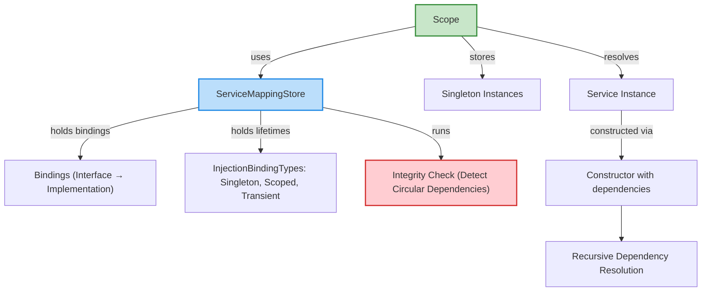

# Key Features at a Glance

Unlock the full potential of your .NET applications with a Dependency Injection Framework designed for simplicity, safety, and scalability. This page distills the library’s standout capabilities into clear features, enabling you to assess quickly how it can transform your service management and object lifecycle control.

---

## Why This Page Matters

Before diving into setup or usage, understanding the core features of this framework will help you evaluate its fit for your project. These features align with common developer priorities: type-safe registration, clear service lifetimes, automatic dependency resolution, integrity assurance, and extensibility.

By grasping these capabilities now, you’ll navigate other documentation pages and tutorials with confidence and clarity.

---

## Core Features Explained

### 1. Type-Safe Service Registration

Register your services with compile-time safety to reduce runtime errors. The framework uses generic methods to bind interfaces to concrete implementations, ensuring:

- You can only register valid types.
- Mismatched or invalid bindings are caught early.

**Example:**

```csharp
serviceMappingStore.AddSingleton<IDepInterface1, DepClass1>();
serviceMappingStore.AddTransient<IDepInterface2, DepClass2>();
serviceMappingStore.AddScoped<IDepInterface3, DepClass3>();
```

This strongly typed approach enforces correctness, making your DI configuration robust from the start.

---

### 2. Scoped Service Resolution with Lifecycle Awareness

The framework distinctly supports three lifetimes:

- **Singleton:** One instance exists globally for all resolutions.
- **Scoped:** One instance per resolution scope, ideal for unit-of-work scenarios.
- **Transient:** New instance on each resolution, suited for lightweight or stateless services.

This flexibility lets you precisely control object lifetimes, optimizing resource consumption and behavior.

### 3. Automatic Dependency Resolution

Forget manual constructor invocations for your service dependencies. Upon request, the framework:

- Analyzes constructor parameters.
- Resolves all dependent services recursively.
- Instantiates the full object graph automatically.

For example, resolving `IDepInterface5` will automatically instantiate and inject nested dependencies like `IDepInterface4`, `IDepInterface3`, and their dependencies in turn.

### 4. Integrity Checks to Prevent Circular Dependencies

At registration time, the framework performs an integrity check that traverses your dependency graph to detect circular references.

If a cycle exists, the system throws a clear exception with the dependency chain causing the issue.

This proactive validation prevents runtime crashes and helps maintain clean, maintainable architecture.

### 5. Extensible Design for Future Growth

Built with modularity in mind, the framework lets you extend and customize behavior without changing core mechanisms. Whether you want to add new lifetime management types, customize resolution logic, or integrate with other tools, the architecture supports seamless enhancement.

---

## Real-World Example Workflow

Consider a user building a web API where services must share state per HTTP request but retain some singleton dependencies. By using scoped lifetimes, the developer can:

1. Register data repositories as scoped services, ensuring fresh instances per request.
2. Register logging and configuration services as singletons for efficiency.
3. Allow transient services to handle small stateless operations.

Upon resolving a top-level service, the framework automates injecting all necessary dependencies respecting these lifetimes—saving manual wiring and reducing errors.

---

## Best Practices and Tips

- **Always run integrity checks** after service registrations to catch errors early.
- Use **scoped lifetimes** for per-request or transactional boundaries.
- Limit use of **transient lifetimes** to stateless, cheap-to-create services to avoid performance overhead.
- Register abstractions (interfaces) rather than concrete types to maximize flexibility.
- Leverage automatic resolution to simplify testing by mocking registered interfaces.

---

## Troubleshooting Common Issues

<AccordionGroup title="Troubleshooting" >
<Accordion title="Circular Dependency Exception">
If you encounter an exception citing circular references, review your service constructors to identify dependencies looping back. Consider refactoring to break cycles, possibly by introducing factories or proxies.
</Accordion>
<Accordion title="Missing Service Registration">
If resolution fails because a required service type hasn’t been mapped, verify that all interface-to-implementation bindings are added before running integrity checks.
</Accordion>
<Accordion title="Unexpected Multiple Instances">
Ensure that you used the correct lifetime (Singleton vs Scoped vs Transient). For shared instances, Singleton or Scoped are appropriate.
</Accordion>
</AccordionGroup>

---

## How This Fits in the Documentation Suite

This page complements the following key resources:

- [Product Introduction & Value Proposition](/overview/introduction-core-concepts/product-introduction-value) to understand why this framework exists.
- [System Architecture & Data Flow](/overview/architecture-features-getting-started/architecture-visual) for visualizing runtime behaviors.
- [Quick Start: From Registration to Resolution](/overview/architecture-features-getting-started/quick-start-example) to implement your first example.

Explore these after reviewing key features to deepen your practical understanding.

---

## Summary

The BSP Dependency Injection Framework delivers type-safe registration, scoped lifecycle management, automatic recursive resolution, preventive integrity checks, and extensibility. These standout features empower you to build maintainable, scalable .NET applications efficiently.

Embrace these benefits to gain full control over your service lifetimes and dependencies with hassle-free automation.

---

## Sample Code Snippet

```csharp
var serviceMappingStore = new ServiceMappingStore();
serviceMappingStore.AddSingleton<IDepInterface1, DepClass1>();
serviceMappingStore.AddTransient<IDepInterface2, DepClass2>();
serviceMappingStore.AddScoped<IDepInterface3, DepClass3>();
serviceMappingStore.IntegrityCheck();

var scope = new Scope(serviceMappingStore);
var instance = scope.GetInstance<IDepInterface3>();
instance.DoThing();
```

This snippet shows typical workflow: register services, verify integrity, create a scope, and resolve instances—all with transparent dependency resolution.


---

## Visual Summary



This diagram maps the relationships between core components: the mapping store with registrations and lifetimes, scope managing instances, integrity checking, and the recursive resolution flow that realizes complex service graphs.

---

## Next Steps

- Proceed to [Quick Start Guide](/overview/architecture-features-getting-started/quick-start-example) to register your first services and resolve instances.
- Review [Core Concepts and Terminology](/overview/introduction-core-concepts/core-terminology-concepts) to deepen conceptual understanding.
- Explore [Performance Tips & Optimization](/guides/real-world-usage/performance-optimization) for fine-tuning your setup.

---

Unlock seamless dependency injection with confidence—start here to identify how this framework meets your project’s architecture needs.
