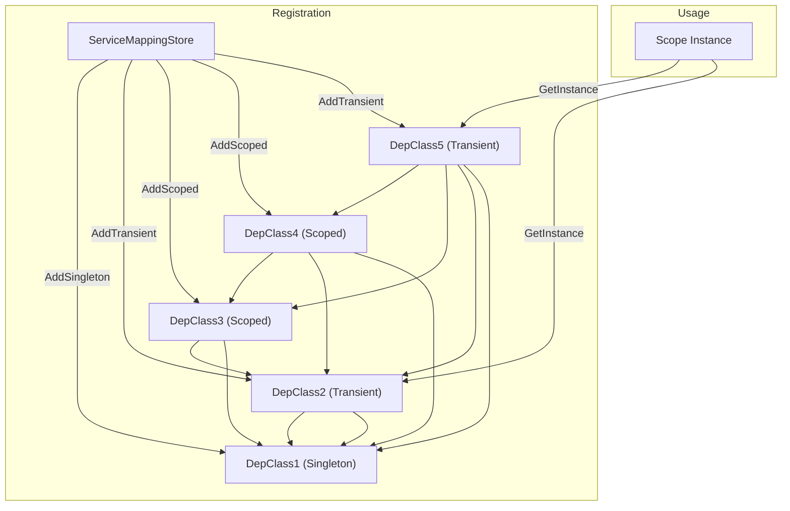

# Quick Start: From Registration to Resolution

Welcome to a hands-on introduction that takes you step-by-step through the core workflow of registering services, creating a scope, and resolving dependencies using the BSP Dependency Injection Framework. This guide uses the provided Example project to illustrate these concepts with real code and an interactive dependency resolution experience.

---

## Why This Quick Start Matters

Modern software development relies on clear, testable, and maintainable code. Managing dependencies manually quickly becomes cumbersome, error-prone, and difficult to scale. This page shows you how to use the BSP DI Framework to automate and simplify this critical part of your applications. After completing this tutorial, you will:

- Understand how to register services with varying lifetimes.
- Create a resolution scope to manage service lifecycles.
- Resolve service instances automatically with all dependencies injected.
- Detect circular dependencies to avoid runtime failures.


## What You Will Learn Here

This Quick Start demonstrates the minimal, practical steps to get your first dependency injection scenario up and running.

- Registering services using singleton, scoped, and transient lifetimes.
- Creating a scope instance to perform resolution.
- Resolving services and witnessing constructor injection in action.
- Observing how lifetimes affect instance reuse.

This is not a deep dive into every feature but a direct, work-through example to build confidence and understanding.


---

## Service Registration: Defining Your Dependency Map

Services are registered inside a `ServiceMappingStore` by associating interfaces with their concrete implementations. BSP DI supports three lifetimes:

- **Singleton**: One shared instance for the whole application.
- **Scoped**: One instance per resolution scope.
- **Transient**: A new instance is created every time it’s requested.

In the Example project, the `CaseRunner.Run` method exemplifies this registration:

```csharp
var serviceMappingStore = new ServiceMappingStore();

serviceMappingStore.AddSingleton<IDepInterface1, DepClass1>();     // Singleton
serviceMappingStore.AddTransient<IDepInterface2, DepClass2>();     // Transient
serviceMappingStore.AddScoped<IDepInterface3, DepClass3>();         // Scoped
serviceMappingStore.AddScoped<IDepInterface4, DepClass4>();         // Scoped
serviceMappingStore.AddTransient<IDepInterface5, DepClass5>();      // Transient

// Optional: Check for circular dependencies before resolving
serviceMappingStore.IntegrityCheck();
```

### Tip:
- Always run `IntegrityCheck()` after registrations to catch circular references promptly.


## Creating a Resolution Scope

Once services are registered, you create a `Scope` instance passing in the `ServiceMappingStore`. Each `Scope` manages lifetimes and handles instance reuse according to the service registration.

```csharp
var scope = new Scope(serviceMappingStore);
```

Think of a `Scope` as a container where scoped and singleton services live during resolution.


## Resolving Dependencies: Let the Framework Do the Work

Using the scope, you request instances of your service interfaces. BSP DI automatically:

- Resolves all constructor dependencies recursively.
- Provides instances respecting their lifetime.
- Caches singleton and scoped instances appropriately.

Example:

```csharp
var instance1 = scope.GetInstance<IDepInterface5>();
instance1.DoThing();

Console.WriteLine("new scope");

var instance2 = scope.GetInstance<IDepInterface2>();
instance2.DoThing();
```


### What Happens Under the Hood?

- For `IDepInterface5`, the framework creates a `DepClass5` instance.
- It sees `DepClass5` depends on `IDepInterface4`, `IDepInterface3`, `IDepInterface2`, and `IDepInterface1`.
- Recursively, it resolves these dependencies in turn.
- Singleton instances (`DepClass1`) are reused.
- Scoped instances (`DepClass3`, `DepClass4`) are shared within this scope.
- Transient (e.g., `DepClass2`) get fresh instances every resolve.

This chain allows complex dependency graphs to be pieced together automatically.


---

## Visualizing the Dependency Resolution Flow

Below is a simplified Mermaid.js flowchart showing service registration, scope creation, and recursive resolution:




## Common Pitfalls and Tips

<AccordionGroup title="Quick Start Troubleshooting">
<Accordion title="Circular Dependency Detection">

If your registrations cause circular dependencies, the `IntegrityCheck()` method throws an exception showing the cycle, preventing runtime errors. For example:

```csharp
serviceMappingStore.AddSingleton<ICircSelf, CircSelf>(); // This will fail if there is a circular loop
serviceMappingStore.IntegrityCheck();
```

Make sure to address any circular references before trying to resolve services.

</Accordion>
<Accordion title="Lifetime Confusion and Instance Reuse">

- Singleton instances are created once and reused every time.
- Scoped instances live within a scope instance and are reused during that scope.
- Transient instances are always freshly created.

Misunderstanding lifetimes leads to unexpected behavior. Use scoped lifetimes carefully when you want isolated instance reuse.

</Accordion>
<Accordion title="Missing Service Registration">

Trying to resolve a service or dependency that wasn’t registered causes a runtime exception. Always register every interface or class before resolving them.

</Accordion>
</AccordionGroup>


---

## What’s Next?

Now that you've walked through a minimal but complete example of registering services, creating a scope, and resolving dependencies:

- Explore the [System Architecture & Data Flow](https://your-doc-site/overview/architecture-features-getting-started/architecture-visual) page to see how components interact internally.
- Learn about [Registering and Managing Services](https://your-doc-site/guides/getting-started/registering-services) for advanced registration scenarios.
- Try the [Practical Use Cases and Example Workflows](https://your-doc-site/guides/real-world-usage/use-cases) to see the framework in real projects.

Dive deeper to master lifetime management, extend the framework, and optimize your DI usage.

---

## Summary

This quick start has:

- Guided you through practical service registration using `ServiceMappingStore`.
- Illustrated scope creation and how lifetimes affect service instances.
- Demonstrated recursive resolution with real code from the Example project.
- Shared best practices and troubleshooting tips to ensure smooth implementation.

Leverage this foundation to build scalable, maintainable .NET applications with ease using BSP Dependency Injection.


---

## Additional Resources

- [Example Project Source Code](https://github.com/bspjojo/DependencyInjection/tree/main/BSP.Example)
- [Core Concepts & Terminology](https://your-doc-site/overview/introduction-core-concepts/core-terminology-concepts)
- [Key Features Overview](https://your-doc-site/overview/architecture-features-getting-started/feature-highlights)
- [Getting Started Setup & Installation](https://your-doc-site/getting-started/setup-and-installation/prerequisites-requirements)


---

## Code Snippet: Full Registration and Resolution Example

```csharp
public class CaseRunner
{
    public void Run()
    {
        var serviceMappingStore = new ServiceMappingStore();

        serviceMappingStore.AddSingleton<IDepInterface1, DepClass1>();
        serviceMappingStore.AddTransient<IDepInterface2, DepClass2>();
        serviceMappingStore.AddScoped<IDepInterface3, DepClass3>();
        serviceMappingStore.AddScoped<IDepInterface4, DepClass4>();
        serviceMappingStore.AddTransient<IDepInterface5, DepClass5>();

        serviceMappingStore.IntegrityCheck();

        var scope = new Scope(serviceMappingStore);

        var instance1 = scope.GetInstance<IDepInterface5>();
        instance1.DoThing();

        Console.WriteLine("new scope");

        var instance2 = scope.GetInstance<IDepInterface2>();
        instance2.DoThing();
    }
}
```
