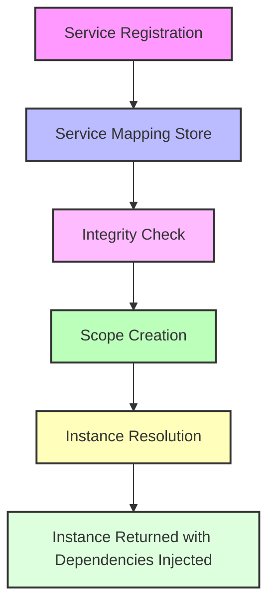

# Core Concepts & Terminology

Welcome to the foundational guide for understanding the critical terms and abstractions of the BSP Dependency Injection Framework. This page demystifies the key concepts you need to onboard quickly and start managing your application's dependencies with confidence.

---

## Unlocking Dependency Injection: Key Terms Explained

To effectively use this Dependency Injection (DI) framework, it's essential to grasp its core concepts — from how services are registered, how lifetimes govern instances, to how scopes operate under the hood. Here's a clear introduction aimed at developer workflows.

### Service Registration

Service Registration is where you define how interfaces relate to their concrete implementations within the DI container. Instead of manually creating instances, you tell the system:

- Which interface maps to which class.
- How you want the system to manage the lifecycle of that service.

You use explicit methods to register these mappings:

- `AddSingleton<TInterface, TImplementation>()`
- `AddScoped<TInterface, TImplementation>()`
- `AddTransient<TInterface, TImplementation>()`

Each reflects a different lifetime policy:

- **Singleton**: One shared instance throughout the application's lifetime.
- **Scoped**: One instance per resolution scope.
- **Transient**: A new instance every time it's requested.

#### Example

```csharp
serviceMappingStore.AddSingleton<IDepInterface1, DepClass1>();
serviceMappingStore.AddTransient<IDepInterface2, DepClass2>();
serviceMappingStore.AddScoped<IDepInterface3, DepClass3>();
```

This means whenever `IDepInterface1` is requested, `DepClass1` will be provided, and the object lifetime governed by Singleton semantics.

### Scope

A **Scope** represents a boundary for service lifetimes, particularly for Scoped services. It controls how instances are shared and reused.

- When you begin a new scope, Scoped services start fresh.
- Within the scope, the same instance is reused.
- Above all scopes, Singleton instances exist once per application lifetime.

Scopes enable finer control and isolation, which is crucial in scenarios like web requests or batch jobs.

#### Workflow Example

```csharp
var scope = new Scope(serviceMappingStore);
 var instance1 = scope.GetInstance<IDepInterface5>(); // Creates and injects dependencies respecting lifetimes
```

Scoped instances created here will remain unique per this `scope` object.

### Service Mapping Store

This is the registry that holds all service registrations and their corresponding lifetimes. It:

- Keeps track of all interfaces and their concrete types.
- Manages the binding type: Singleton, Scoped, or Transient.
- Performs integrity checks to prevent circular dependencies that cause runtime errors.

#### What It Does

- When adding a binding, it associates `TInterface` with `TImplementation` and the binding type.
- Before resolution, it validates that all dependencies can be constructed without circular references.

#### Sample Integrity Check Error

```text
Exception: Circular reference detected. CircSelf -> CircSelf
```

This proactive detection saves debugging time by identifying service cycles early.

### Instance Resolution

Instance Resolution is the process of retrieving an actual object for a requested interface, following the registered mappings and respecting lifetimes.

How it works:

1. You request an instance via `GetInstance<T>()`.
2. The framework finds the implementation type.
3. It checks lifetime rules to reuse or create instances.
4. It resolves constructor dependencies recursively.

Every call to `GetInstance` cascades into constructing the dependency graph automatically.

#### Example User Flow

```csharp
var instance = scope.GetInstance<IDepInterface5>();
instance.DoThing();
```

Behind the scenes, this triggers constructing `DepClass5` along with its dependencies:

- `DepClass5` depends on `IDepInterface4`, `IDepInterface3`, `IDepInterface2`, and `IDepInterface1`.
- Those dependencies are retrieved respecting their lifetime scopes.

You get a fully assembled object graph ready to use with minimal manual wiring.

---

## How These Concepts Fit Together

Visualize the flow from registration to resolution:



---

## Practical Tips & Best Practices

- **Always perform integrity checks** after registering services to catch circular dependencies early.
- Register singleton services only when you truly want a single shared instance.
- Use scoped services to maintain context-specific instances, such as during a web request.
- Use transient services for stateless, lightweight objects.
- Keep constructor injection focused to minimize complexity.

---

## Common Pitfalls to Avoid

- Forgetting to register a dependent interface will cause resolution failures at runtime.
- Circular dependencies will throw exceptions unless carefully managed or refactored.
- Misunderstanding lifetimes can cause unintended shared state or excessive object creation.

---

## Summary

This page lays out the critical vocabulary and operational flow needed to harness the BSP Dependency Injection Framework efficiently. By mastering Service Registration, Scope, Service Mapping Store, and Instance Resolution, you ensure your application’s dependencies are cleanly managed and your codebase stays maintainable.

Proceed to learn how these core concepts fit into the bigger picture in the [System Architecture & Data Flow](../../overview/architecture-features-getting-started/architecture-visual) page or jump straight into hands-on examples in the [Quick Start: From Registration to Resolution](../../overview/architecture-features-getting-started/quick-start-example) guide.

---

## Related Documentation

- [What is This Dependency Injection Framework?](../introduction-core-concepts/product-introduction-value) — Gain context on the framework’s purpose and overall value proposition.
- [Who Is It For? Audience & Use Cases](../introduction-core-concepts/target-audience-use-cases) — Understand typical users and scenarios.
- [System Architecture & Data Flow](../../overview/architecture-features-getting-started/architecture-visual) — Visualize how components interact.
- [Quick Start: From Registration to Resolution](../../overview/architecture-features-getting-started/quick-start-example) — Jump into hands-on setup and usage examples.

---

## Code Example Summary:

Below is a brief code snippet showing service registration and resolution demonstrating the concepts:

```csharp
var serviceMappingStore = new ServiceMappingStore();
serviceMappingStore.AddSingleton<IDepInterface1, DepClass1>();
serviceMappingStore.AddTransient<IDepInterface2, DepClass2>();
serviceMappingStore.AddScoped<IDepInterface3, DepClass3>();

serviceMappingStore.IntegrityCheck();

var scope = new Scope(serviceMappingStore);
var instance = scope.GetInstance<IDepInterface3>();
instance.DoThing();
```

This small program registers services, checks for dependency loops, creates a scope, and resolves an instance ready for use.

---

This foundational knowledge ensures you get the most from the DI framework and set strong precedents for scalable, maintainable architecture.


