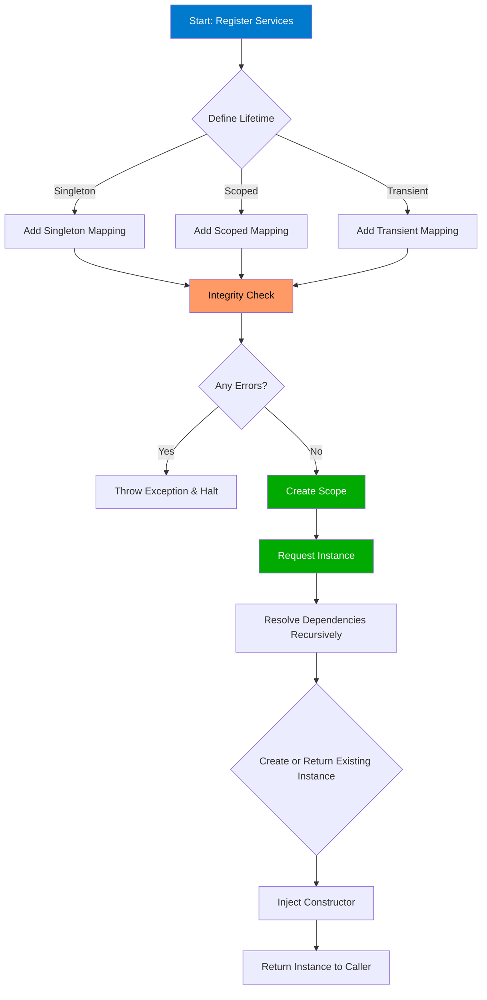

# What is This Dependency Injection Framework?

A modern, lightweight Dependency Injection (DI) library designed exclusively for .NET developers seeking simplicity, flexibility, and robust lifecycle management without the overhead of bulky frameworks.

---

## Unlocking Scalable & Modular Codebases

This Dependency Injection Framework streamlines how your application constructs and manages objects throughout their lifecycle. By handling the instantiation and lifetime of dependencies automatically, it empowers you to build scalable, testable, and maintainable codebases effortlessly.

### Why This Matters to You

- **Simplify object creation**: Avoid manual, error-prone instantiation and dependency wiring.
- **Control lifetime and scope**: Choose singleton, scoped, or transient lifetimes tailored to your application's needs.
- **Promote loose coupling**: Enable modular design and easier testing by depending on abstractions, not concrete implementations.
- **Minimize dependencies**: This DI library adds minimal overhead to your project, designed to be lightweight.
- **Detect circular dependencies early**: Integrity checks prevent application runtime errors from hidden circular references.

### Who Should Use This Framework?

.NET developers, teams, and organizations focused on clean, modular architecture, particularly those who want a minimalistic DI solution without sacrificing capability or performance.

---

## What Is This Dependency Injection Framework?

At its core, this framework is a **.NET-centric dependency injection library** specializing in injecting dependencies into your objects automatically, managing object creation and lifecycle seamlessly.

### Core Purpose & Value

In any sizable application, managing dependencies manually grows complicated and fragile. This framework solves that by being a lightweight orchestrator of object construction:

- **Automatically resolves dependencies:** When a class requires other services, you just declare them in the constructor.
- **Manages object lifetimes:** Singleton instances are shared; scoped instances belong to a resolution context; transient instances are fresh every time.
- **Ensures configuration integrity:** Before running, it checks your registrations for missing dependencies and circular references.

### What Sets It Apart?

- **Lightweight and minimal dependencies:** Unlike large DI containers, it keeps your binaries lean.
- **Elegant lifecycle support:** Full singleton, scoped, and transient support without complexity.
- **Explicit integrity validation:** Prevents runtime surprises by detecting misconfigurations early.

---

## Key Features & Capabilities

### 1. Service Registration with Lifecycle Control
You define your service mappings with clear intent using three lifetime options:
- **Singleton:** One shared instance for the application's life.
- **Scoped:** One unique instance per resolution scope.
- **Transient:** Always creates a new instance when requested.

Example from the CaseRunner:

```csharp
serviceMappingStore.AddSingleton<IDepInterface1, DepClass1>();
serviceMappingStore.AddTransient<IDepInterface2, DepClass2>();
serviceMappingStore.AddScoped<IDepInterface3, DepClass3>();
```

### 2. Automatic Dependency Resolution
During instance creation, the framework inspects constructor parameters and recursively resolves each dependency, eliminating manual wiring.

Example:

- `DepClass5` depends on `IDepInterface4`, `IDepInterface3`, `IDepInterface2`, and `IDepInterface1`.
- When resolved, all transitively required dependencies are created and wired automatically.

### 3. Scope Management
Scopes group instances with defined lifetimes, such as scoped services limited to a request or operation.

- Creating a new `Scope` triggers fresh scoped instances while reusing singletons.
- You can resolve multiple instances independently within scope boundaries.

### 4. Integrity Checks for Safety
Before resolving services, the framework performs:
- **Missing dependency detection:** Ensures all dependencies are registered.
- **Circular dependency detection:** Detects cycles and raises exceptions.

Try activating circular services is commented out in examples, preventing runtime crashes.

### 5. Detailed Lifecycle Logging
Verbose console logs during instantiation help you understand how instances flow through your application.

---

## Why Should You Care?

### Achieve More With Less Overhead
This framework lets you delegate the complexity of dependency management to a small tool that blends naturally into your .NET applications.

### Real-World Scenarios
- **Building modular services:** Easily swap implementations for testing or feature toggles.
- **Rapid prototyping:** Quickly register and resolve services without boilerplate.
- **Complex dependency graphs:** Automatically resolve deep dependency chains confidently.
- **Ensuring application stability:** Find configuration errors like circular dependencies before deployment.

### Before vs After
- **Before:** Manually instantiate and pass dependencies everywhere, leading to clutter and tight coupling.
- **After:** Declare dependencies, register mappings, and let the framework do the rest.

### Return on Investment (ROI)
- Save developer time wiring dependencies
- Improve code quality and maintainability
- Reduce runtime errors and debugging effort

---

## How It Works (Simplified Flow)



---

## Getting Started Preview

### Quick Start Steps
1. Create a new `ServiceMappingStore`.
2. Register your dependencies with their lifetimes (`AddSingleton`, `AddScoped`, `AddTransient`).
3. Call `IntegrityCheck()` to validate your dependency graph.
4. Create a new `Scope` from your mappings.
5. Resolve instances via `scope.GetInstance<T>()` and use as needed.

### Prerequisites
- Basic .NET development environment with target framework `.NET Core 3.1` or later.
- Familiarity with interfaces and constructor injection concepts.

### Next Steps
- Explore [Who Is It For? Audience & Use Cases](#) to align the framework with your project's goals.
- Dive into [Core Concepts & Terminology](#) to understand DI basics essential for mastering this framework.
- Follow the [Quick Start: From Registration to Resolution](#) guide for hands-on configuration example.

---

This framework offers a powerful, elegant starting point for your dependency injection needs — providing the benefits of DI without the complexity or bloat of larger containers. Take control of your application's architecture today and enjoy cleaner, more maintainable .NET code.


---

## Additional Reference Example (Excerpt from Example Usage)

```csharp
var serviceMappingStore = new ServiceMappingStore();
serviceMappingStore.AddSingleton<IDepInterface1, DepClass1>();
serviceMappingStore.AddTransient<IDepInterface2, DepClass2>();
serviceMappingStore.AddScoped<IDepInterface3, DepClass3>();

serviceMappingStore.IntegrityCheck();
var scope = new Scope(serviceMappingStore);

var instance = scope.GetInstance<IDepInterface5>();
instance.DoThing();
```

This snippet shows how easily complex dependency chains are resolved automatically, illustrating the framework's power with minimal code.


---