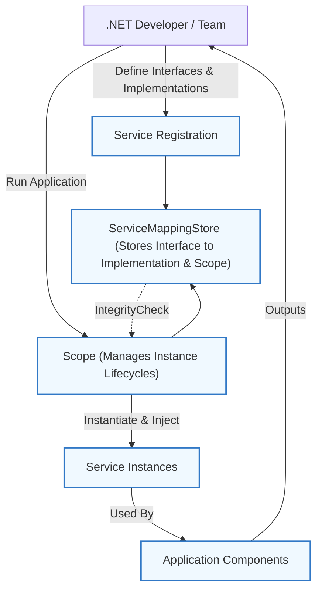

# Who Is It For? Audience & Use Cases

## Unlocking Modern .NET Development with Purpose-Built Dependency Injection

Whether you're building a small-scale project or architecting a complex enterprise system, understanding who this Dependency Injection Framework is designed for ensures maximum efficiency and cleaner code. This page clarifies the ideal users, typical scenarios, and how this framework empowers developers to achieve robust, maintainable applications.

---

## Perfectly Tailored for .NET Developers and Teams

This lightweight yet powerful Dependency Injection Framework is expressly designed for **.NET developers** who aim to:

- Build applications with a clear separation of concerns.
- Manage service lifetimes seamlessly (Singleton, Scoped, Transient).
- Avoid manual object instantiation and tightly coupled dependencies.
- Improve testability by simplifying dependency management.
- Catch lifecycle and circular dependency issues early through integrity checks.

### Ideal Users Include:

- **Individual .NET developers** building modular and testable components.
- **Agile development teams** seeking consistent, maintainable service management.
- **Architects and leads** designing scalable applications requiring clear dependency flow.
- Developers maintaining legacy .NET applications looking to introduce modern DI patterns.

## Core Use Cases: Powering Your Application’s Dependency Management

This framework shines in scenarios including but not limited to:

### 1. Service Registration & Flexible Deployment

- Easily register service interfaces and their implementations with appropriate lifecycle:
  - **Singleton** for globally shared services.
  - **Scoped** for per-resolution instances, such as request-based lifespan.
  - **Transient** for fresh instances on each request.

This simplifies setting up your application's dependency graph according to specific lifetime needs.

### 2. Transparent Dependency Resolution

- Resolve complex dependency chains effortlessly with automatic constructor injection.
- Nest dependencies of any depth while the framework manages instantiation order.
- Prevent circular dependencies and detect them in advance with built-in integrity checks.

### 3. Seamless Scope Management

- Benefit from scopes that isolate instances, useful for multi-tenant or multi-request scenarios.
- Support for scoped instances ensures resources are reused within a defined context but refreshed thereafter.

### 4. Enabling Unit Testing and Modular Design

- Register mock or stub implementations easily by swapping bindings.
- Test components in isolation without manual setup of dependent objects.

### 5. Suitable for Small to Large Applications

- Small apps gain from reduced boilerplate and easier maintenance.
- Enterprise systems benefit from robustness, lifecycle controls, and prevention of runtime errors related to dependencies.

---

## Visualizing How It Fits

---

## Practical Example: Who Benefits & How

Imagine you're building a web application requiring services with distinct lifetimes:

- A logging service should retain one instance throughout the application lifetime.
- A user session service should be unique per web request.
- An email sender should instantiate fresh every time it’s needed.

This framework lets you express these lifetimes clearly and resolves dependencies automatically, so your application code stays clean and focused on business logic.

---

## Key Benefits Summary

- **Simplifies complex dependency management** by automating instantiation and injection.
- **Improves code maintainability** through decoupled design.
- **Boosts development speed** by removing manual setup.
- **Prevents runtime failures** with built-in circular dependency detection.
- **Supports scalable applications** from simple tools to large enterprise solutions.

---

## Tips and Best Practices

- **Define clear interfaces** for all services to leverage the pattern effectively.
- **Choose the right lifetime scope** to balance resource usage and application responsiveness.
- **Run `IntegrityCheck()` early** in your application start-up to catch potential dependency cycles.
- **Use scoped instances to isolate data-sensitive services** within request boundaries.
- Avoid overly complex dependency graphs to maintain clarity and testability.

---

## Next Steps

To start implementing this framework in your projects, explore:

- [What is This Dependency Injection Framework?](./overview/introduction-core-concepts/product-introduction-value) — Understand core value and features
- [Quick Start: From Registration to Resolution](./overview/architecture-features-getting-started/quick-start-example) — Hands-on example to register and retrieve services
- [Basic Setup & Configuration](./guides/getting-started/basic-setup) — Setup guidance tailored for new users

These pages will guide you from initial setup to advanced usage smoothly.

---